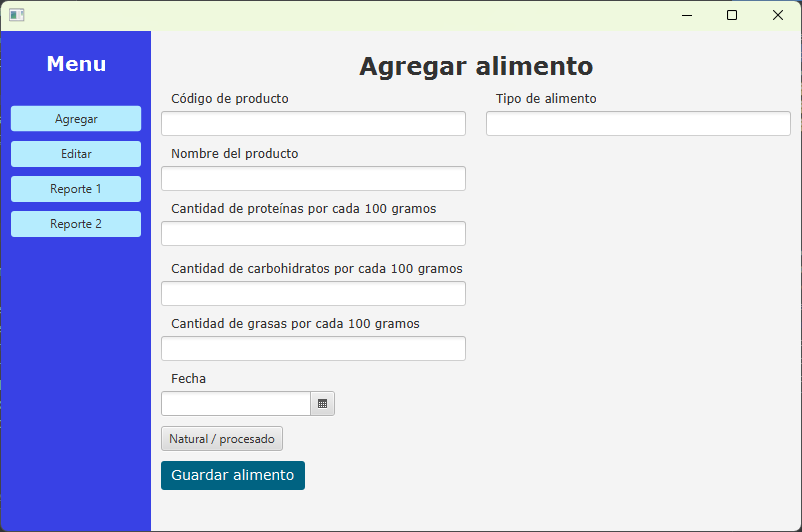

# Food Manager App

## Descripción

La **Food Manager App** es una aplicación para gestionar información sobre alimentos, tanto alimentos naturales como alimentos procesados. Permite agregar nuevos alimentos, editar información existente, eliminar alimentos y generar informes basados en diferentes criterios.

La aplicación está desarrollada en Java utilizando JavaFX para la interfaz gráfica. Los datos se almacenan en un archivo de texto (Alimentos.txt) con formato CSV (valores separados por punto y coma), y la aplicación realiza la lectura y escritura de datos en este archivo para mantener la información de los alimentos.

## Funcionalidades principales

1. **Agregar alimento:** Permite agregar un nuevo alimento ingresando su código, nombre, contenido de proteínas, carbohidratos y grasas. Para los alimentos naturales, también se puede especificar el tipo de alimento.

2. **Editar alimento:** Permite editar la información de un alimento existente, incluyendo su nombre, contenido de proteínas, carbohidratos y grasas. Para los alimentos procesados, se puede modificar la lista de ingredientes.

3. **Eliminar alimento:** Permite eliminar un alimento de la lista de alimentos.

4. **Generar informe por código:** Permite buscar y mostrar información detallada de un alimento específico, ingresando su código.

5. **Generar informe por fecha:** Permite buscar y mostrar una lista de alimentos creados en una fecha específica.

## Notas

La aplicación se ha diseñado para manejar alimentos naturales y procesados. Los alimentos naturales tienen un campo adicional para el tipo de alimento, mientras que los alimentos procesados tienen una lista de ingredientes.

La aplicación es una versión básica de un sistema de gestión de alimentos y se puede mejorar y ampliar según las necesidades y requerimientos específicos.

## Autor

Nombre: Marco Agüero

Universidad: Universidad Estatal a Distancia de Costa Rica
